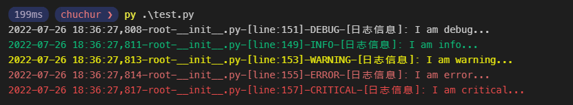

# cloudoll 云端玩具


## Mail

快速配置发送邮件

```python
# test_mail.py

from cloudoll.mail import smtp

MAIL = {
    "smtp_server": "smtp.qq.com",
    "account": "123456789@qq.com",
    "account_name": "chuchur",
    "password": "abcdefg",
    "prot": 465,  # 587
    "debug_level": 1,
}

client = smtp.Client(**MAIL)
# 标题
client.subject = "test title"
# 正文
client.content = "long long ago..."
#收件人
client.add_to_addr("chuchur", "chuchur@qq.com")

# 发送
client.send()
```
### 多个收件人

```python
client.add_to_addr("李彦宏", "liyanhong@baidu.com")
client.add_to_addr("马云", "jackma@alibaba.com")
```

### 附件

```python
filepathA = '/home/chuchur/img/a.jpg'
filepathB = '/home/chuchur/img/b.jpg'

client.addfile(filepathA)
client.addfile(filepathB)

```
### 嵌入html 和 html 调用附件

```python
client.addfile("/home/chuchur/img/a.jpg") # cid 0
client.addfile("/home/chuchur/img/b.jpg") # cid 1
client.addhtml("<html><body><h1>Hello</h1>" + '<p></p>' + "</body></html>")
```


## Orm

操作数据库   
模型映射更新中...

```python
from cloudoll.orm import mysql

MYSQL = {
    "debug": False,
    "db": {
        "host": "127.0.0.1",
        "port": 3306,
        "user": "root",
        "password": "abcdefg",
        "db": "test",
    },
    "session": {"secret": "Awesome"},
}

mysql.connect(loop=None,**MYSQL)

table_name = 'user'

# 取列表
res = msyql.lists(table_name ,where="uid=? and age>30 and name like %?% ",limit=10,offset=20 ,params=[1234,'mayun'])

for item in res:
  print(item)

# 取一条
item = mysql.load(table_name,where="uid=1")

# 新增

data = {
  "name": '马云',
  "sex": 1
}
result = mysql.insert(table_name,**data)

print(result)
# output : { id: 101}

# 修改
data = {
  "id":100,
  "name": '马云',
  "sex": 1
}
result = mysql.update(table_name,**data)
print(result)
# output : True


# 删除
result = mysql.delete(table_name,where="uid=100")
print(result)
# output : True

# 批量修改

result = mysql.update_batch(table_name,where="name=? and sex=1" ,params=['mayun'] ,name="马云")
print(result)

```


## Robot

快速接入 钉钉，飞书机器人

### 钉钉机器人

```python
from cloudoll.robot import dingtalk

webhook = '机器人地址'
secret = '机器人密钥'
access_token = '机器人token' # 可以不设定,上传文件必填

client = dingtalk.Client(
    webhook=webhook,
    secret=secret,
    access_token=access_token,
)

client.sendtext("代码出bug了！")
```

### 飞书机器人

```python
from cloudoll.robot import feishu

webhook = '机器人地址'
secret = '机器人密钥'

client = feishu.Client(
    webhook=webhook,
    secret=secret,
)

client.sendtext("代码出bug了！")
```

## Web

### http 爬虫模块

### 爬取网页

```python
from cloudoll.web import http

result  =  http.get('https://baidu.com')
print(result)

# output:  <html>....</html>
```
### 请求rest api
```python
json = http.get('https://api.xxxx.com/v2/xxxx')
print(json)

# output : { code: 0, message: 'ok'}

http.post ,delete , put ,head ,option
```
### 下载文件
```python
src = 'https://www.baidu.com/img/flexible/logo/pc/result.png'
savepath = '/home/chuchur/download/baidu-logo.png'
http.download(src,savepath)
```
### 代理/头/cookies

```python
url = 'https://xxx.xxx.com'

proxies = {
  'http':'127.0.0.1',
  'https':'127.0.0.1'
}

headers = {
  'token':'xxxxxx'
}

cookies = {
  'username':'admin'
}

data = http.get(url,headers=headers ,cookies=cookies ,proxies=proxies)

```

## logging

日志辅助 ，生成日志文件， 打印彩色文字

```python
# /home/chuchur/work/test.py

from cloudoll import logging

logging.getLogger()
# or
# logging.getLogger(__file__)


logging.debug('I am debug...')
logging.info('I am info...')
logging.warning('I am warning...')
logging.error('I am error...')
logging.critical('I am critical...')

```
控制台：


日志文件：**-all.log

```log
2022-07-26 18:36:27-root-__init__.py-[line:151]-DEBUG-[日志信息]: I am debug...
2022-07-26 18:36:27-root-__init__.py-[line:149]-INFO-[日志信息]: I am info...
2022-07-26 18:36:27-root-__init__.py-[line:153]-WARNING-[日志信息]: I am warning...
2022-07-26 18:36:27-root-__init__.py-[line:155]-ERROR-[日志信息]: I am error...
2022-07-26 18:36:27-root-__init__.py-[line:157]-CRITICAL-[日志信息]: I am critical...

```
日志文件：**-error.log
```log
2022-07-26 18:36:27-root-__init__.py-[line:155]-ERROR-[日志信息]: I am error...

```